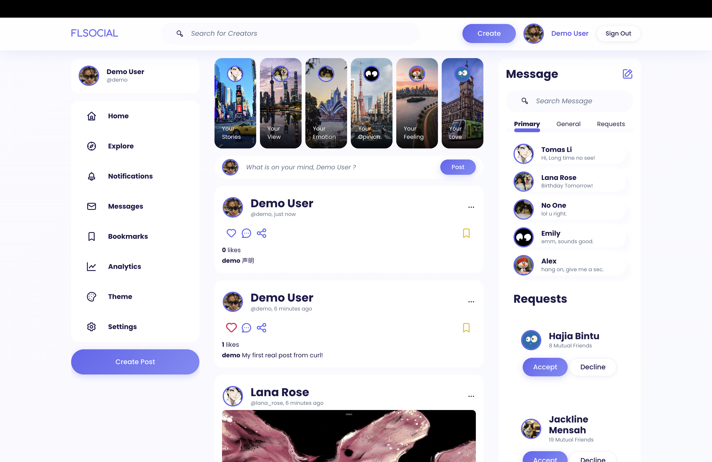

# FLsocial

A full-stack social media web app — register, log in, publish posts, and like other people's posts in a real-time feed. Built from scratch with a vanilla-JS component frontend and an Express + Prisma + JWT backend.


> **Live demo:** https://fl-social-web.vercel.app
> **Demo account:** `demo` / `demo123`
>
> _Note: the backend runs on a free tier and sleeps after inactivity — the first request may take ~50s to wake up._



## Features

- **Authentication** — register & log in; passwords hashed with bcrypt, never stored or transmitted in plain text.
- **Persistent sessions** — JWT stored client-side; on refresh the app auto-restores the session via `GET /api/me`.
- **Real posts** — create a post and it is persisted to the database; the feed is loaded from the backend (no mock data).
- **Likes** — like / unlike any post; counts update optimistically and are persisted per-user (one like per user per post).
- **Hardened backend** — Helmet security headers, rate limiting on auth routes, input validation, and centralized Prisma error handling.
- **Responsive UI** — three-column social layout with collapsible side panels on narrow screens.

## Tech Stack

| Layer    | Technology                                            |
| -------- | ----------------------------------------------------- |
| Frontend | Vite, Vanilla JS (ES modules, class components), Axios, GSAP |
| Backend  | Node.js, Express                                      |
| Database | PostgreSQL via Prisma ORM (Neon)                      |
| Auth     | JWT (`jsonwebtoken`) + bcrypt (`bcryptjs`)            |
| Security | Helmet, express-rate-limit                            |

## Architecture

```
FLSocialWeb/
├── frontend/                 # Vite + vanilla JS
│   ├── index.html
│   ├── index.js              # App bootstrap (builds layout, inits auth)
│   └── src/
│       ├── js/
│       │   ├── api.js        # Axios instance + token injection + API calls
│       │   ├── feed.js       # Load feed, submit posts, apply current user
│       │   ├── auth/         # Login / register / session-restore logic
│       │   ├── components/   # Profile, sidebar, feed cards, etc.
│       │   └── utils.js      # timeAgo / escapeHtml helpers
│       └── css/
└── backend/                  # Express + Prisma + JWT
    ├── index.js              # Server entry, middleware & routes (port 9090)
    ├── prisma/schema.prisma  # User / Post / Like models
    └── src/
        ├── api/              # login, register, me, posts
        ├── utils/            # auth middleware, token, hashing, validation
        ├── lib/prisma.js     # Prisma client singleton
        └── seed.js           # Demo users + posts
```

**Request flow:** Frontend (`api.js`) attaches `Authorization: Bearer <jwt>` → Express route → `requireAuth` / `optionalAuth` middleware verifies the token and sets `req.user` → controller talks to the DB via Prisma → JSON response.

## API Reference

| Method | Endpoint               | Auth      | Description                          |
| ------ | ---------------------- | --------- | ------------------------------------ |
| POST   | `/api/register`        | –         | Create an account                    |
| POST   | `/api/login`           | –         | Log in, returns a JWT + user         |
| GET    | `/api/me`              | required  | Current user (used for auto-login)   |
| GET    | `/api/posts`           | optional  | Feed (adds `likedByMe` when logged in) |
| POST   | `/api/posts`           | required  | Create a post                        |
| POST   | `/api/posts/:id/like`  | required  | Toggle like on a post                |
| GET    | `/health`              | –         | Health check                         |

## Getting Started

Create the env files from the templates and install dependencies:

```bash
cp frontend/.env.example frontend/.env
cp backend/.env.example backend/.env
# Set DATABASE_URL in backend/.env to a PostgreSQL connection string
# (a free Neon database works for both local dev and production)

pnpm install:all
pnpm db:setup        # push the schema to the DB + seed demo data
```

Start the backend and frontend in two terminals:

```bash
pnpm dev:backend     # Backend at http://localhost:9090
pnpm dev:frontend    # Frontend at http://localhost:5173
```

Open http://localhost:5173 and log in with `demo` / `demo123`, or register a new account.

## Security Notes

- Passwords are hashed with bcrypt; the configurable cost factor lives in `SALT_ROUNDS`.
- JWTs carry **only** a user id and username — never the password or its hash.
- Protected routes are guarded by a `requireAuth` middleware; the public feed uses `optionalAuth` to personalize results without requiring a login.
- Auth routes are rate-limited and all credentials are validated server-side.
- User-generated content is HTML-escaped on render to mitigate XSS.

## Deployment

Deployed for free with **Neon** (PostgreSQL) + **Render** (backend) + **Vercel** (frontend).

**1. Database — Neon**
- Create a free project at [neon.tech](https://neon.tech) and copy the connection string (with `?sslmode=require`).

**2. Backend — Render**
- New → Blueprint, point it at this repo (a `render.yaml` is included), or create a Web Service manually with:
  - Root directory: `backend`
  - Build: `npm install && npx prisma generate && npx prisma db push`
  - Start: `node index.js`
- Set env vars: `DATABASE_URL` (Neon string), `ACCESS_TOKEN_SECRET` (random), `CORS_ORIGIN` (your Vercel URL).
- Optionally run `pnpm seed` once from the Render shell to load demo data.

**3. Frontend — Vercel**
- New Project → import this repo, set **Root Directory** to `frontend`.
- Env vars: `VITE_BACKEND_PATH` = your Render backend URL, `VITE_LOGIN_TOKEN` = any key name (e.g. `login_token`).
- Deploy, then put the live URL at the top of this README and in Render's `CORS_ORIGIN`.

## Possible Next Steps

Comments, follow/friend system, real-time messaging (WebSocket), image uploads, and dark-mode theming.
